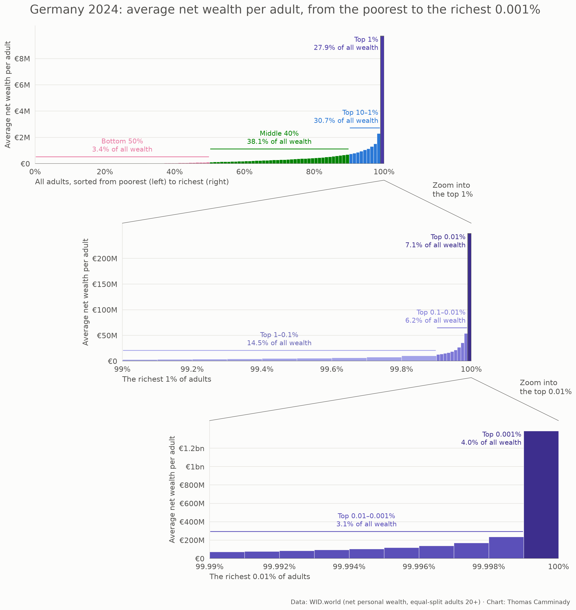
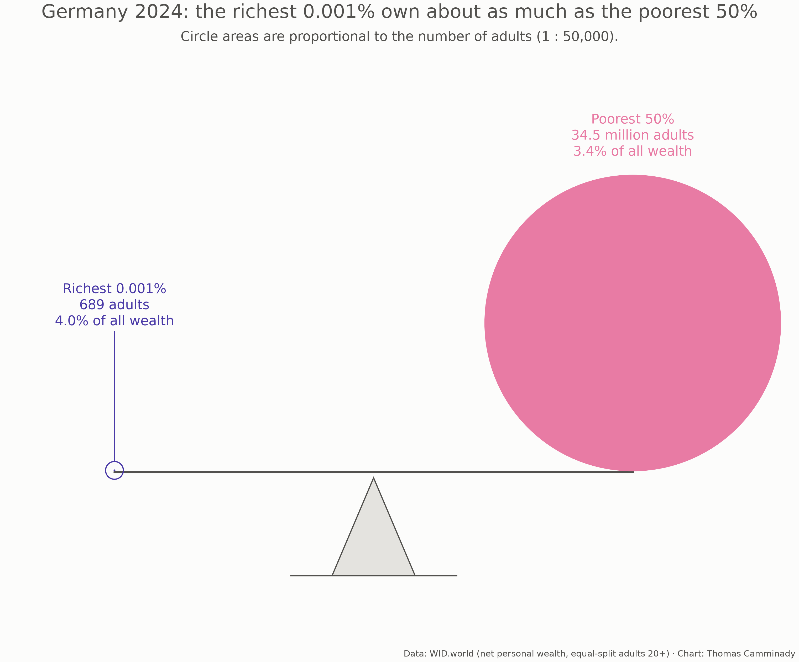

# Wealth inequality in Germany, down to the top 0.001%

Author: Thomas Camminady

Charts of how net wealth is distributed among adults in Germany, using data
from the [World Inequality Database](https://wid.world) (WID.world). Most
published figures stop at "top 10% / middle 40% / bottom 50%"; WID goes down to
the richest 0.001% of adults, which is what these charts use.





## Where the data comes from

All numbers come from WID.world's public bulk download,
<https://wid.world/bulk_download/wid_all_data.zip> (about 880 MB). `make data`
fetches only the Germany file inside it, `WID_data_DE.csv`, via HTTP range
requests, and writes two tidy CSVs to `data/`.

| WID variable | Meaning | Used as |
|---|---|---|
| `shwealj992` | share of total net personal wealth held by a group | `share` |
| `ahwealj992` | average net personal wealth within a group, in euros | `avg_eur` |
| `thwealj992` | net personal wealth at the group's lower threshold, in euros | `threshold_eur` |
| `npopuli992` | number of adults (20+) | `adults` |

WID builds the German wealth series from these sources (as listed in WID's own
metadata):

- Albers, T., Bartels, C. & Schularick, M. (2020).
  [The Distribution of Wealth in Germany, 1895–2018](https://www.econtribute.de/RePEc/ajk/ajkpbs/ECONtribute_PB_001_2020.pdf).
  ECONtribute Discussion Paper.
- Blanchet, T. & Martinez-Toledano, C. (2021).
  [Distributional Financial Accounts in Europe](http://wid.world/document/distributional-financial-accounts-in-europe-world-inequality-lab-technical-note-2021-12/).
  World Inequality Lab technical note 2021/12.
- Bajard, F. et al. (2025).
  [Global wealth inequality on WID.world: Estimates and imputations](https://wid.world/document/global-wealth-inequality-on-wid-world-estimates-and-imputations-world-inequality-lab-technical-note-2025-01/).
  World Inequality Lab technical note 2025/01 (the update to recent years).

## What "wealth" means here

**Net personal wealth**, in WID's definition: the total value of non-financial
and financial assets held by households (housing, land, deposits, bonds,
equities, etc.), minus their debts. The household sector follows the national
accounts: all households and private individuals, including people living in
institutions, plus unincorporated businesses whose accounts are not separated
from their owners'. Pension entitlements from public pay-as-you-go systems are
not assets in this sense.

**Who is counted**: adults aged 20 and over. The unit is the individual, but
wealth is **split equally within couples** ("equal-split adults"): a couple
with €400k together counts as two adults with €200k each. Net wealth can be
negative (debts larger than assets); in some charts these values are cut off
at €0.

**Groups**: adults are ranked from poorest to richest, and "top 1%" means
the richest 1% of that ranking. In 2024 Germany has 68.9 million adults, so
the top 1% is about 689,000 people, the top 0.001% about 689 people, and the
bottom 50% about 34.5 million people.

**Resolution**: WID publishes 127 "generalized percentile" bins per year:
1% steps up to the 99th percentile, then 0.1% steps up to 99.9, 0.01% steps up
to 99.99, and 0.001% steps up to 100. There is no finer data than the top
0.001%.

## How the numbers are estimated, and what to keep in mind

- **The top is modelled, not measured.** Germany has not levied a wealth tax
  since 1997, so there are no tax records of wealth. The estimates combine
  household surveys (the Bundesbank's PHF and the SOEP) with rich lists, fit a
  Pareto distribution to the top tail, and scale the result to the household
  balance sheet in the national accounts. The finer the group, the more the
  number depends on that model: the top 0.001% is the most model-based figure.
- **Recent years are updates.** The underlying study ends in 2018; later years,
  including the 2024 values shown here, are WID updates and imputations.
- **Shares are computed from averages.** WID rounds `share` to four decimals,
  which leaves only two significant digits for the smallest bins. The charts
  therefore compute each group's share from `avg_eur × bin width` (bin width
  being the share of adults in the bin), which agrees with WID's rounded
  shares and adds up to exactly 100%.
- **Euros** are WID's figures for the year shown, so the 2024 charts are in
  2024 euros.
- **Population** for 2024 is WID's adult population (individuals 20+). WID
  notes a break in the official population series in 2011.

## Data files

- `data/germany_wealth_gpercentiles_wid.csv`: one row per year (1820–2024) and
  bin: `year, percentile, lo, hi, avg_eur, share, threshold_eur`. `lo` and `hi`
  are the bin's bounds in percent of adults (e.g. `99.999` to `100`). The bins
  are disjoint, so a year's shares add up to 1.
- `data/germany_adults_wid.csv`: `year, adults`, the number of adults (20+).

## Usage

```bash
make install     # uv sync
make hooks       # install pre-commit hooks (ruff, ty, nbstripout)
make data        # download Germany from WID and write data/*.csv
make plots       # all charts -> output/
make plot-balance YEAR=2018
make plot-percentiles-staircase-de   # the staircase figure in German
make check       # all pre-commit hooks on all files
```

The commands are also available directly: `uv run fetch-data`, `uv run plot-line`,
`uv run plot-donut`, `uv run plot-bar-donut`, `uv run plot-percentiles`,
`uv run plot-percentiles-zoom`, `uv run plot-percentiles-staircase`,
`uv run plot-wealth-donut`, `uv run plot-balance` (each takes `--year`,
`--csv_path`, `--out_path`). The staircase also takes `--lang de` for a German version.

Code layout: `src/wid/io` downloads and loads the data, `src/wid/plotting`
draws the charts, `src/wid/cli.py` holds the command-line entry points.
